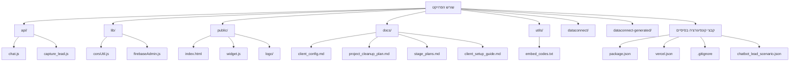

# תוכנית לסידור ושיפור פרויקט הצ'אטבוט

מסמך זה מתאר את המצב הנוכחי של הפרויקט ומציג תוכנית פעולה לשיפור הסדר והגמישות, במיוחד בנוגע ללכידת לידים והגדרות לכל לקוח.

**המצב הנוכחי:**

1.  **שליחת מיילים לכל לקוח בנפרד:** המערכת **כבר תומכת** בשליחת מיילים לכתובת שונה עבור כל לקוח. בקובץ `api/capture_lead.js`, המערכת קוראת את כתובת המייל לשליחת לידים ( `leadTargetEmail` ) מתוך מסמך ההגדרות של הלקוח באוסף `brains` בפיירבייס. זה אומר שכל מה שצריך לעשות כדי לשלוח מיילים לכתובת אחרת עבור לקוח מסוים, זה לעדכן את השדה `leadTargetEmail` במסמך המתאים באוסף `brains` בפיירבייס.
2.  **לכידת לידים שונה לכל לקוח:** כרגע, הלוגיקה של לכידת הלידים בקובץ `api/capture_lead.js` היא אחידה לכל הלקוחות. היא תמיד מצפה לקבל שם, פרטי קשר והיסטוריית שיחה. אם תרצה "תפיסת ליד שונה" שכוללת שדות אחרים, ולידציה שונה, או לוגיקה אחרת לגמרי, זה ידרוש שינויים בקוד של `api/capture_lead.js` או יצירת נקודות קצה (endpoints) שונות ללקוחות שונים.
3.  **בלגן בפרויקט:** זיהינו שיש קצת כפילויות וקבצים שנראים לא מסודרים, במיוחד הקובץ `src/firebaseAdmin.js` שהוא כנראה כפילות של `lib/firebaseAdmin.js`, והתיקייה `chatbotfinale.final/` שנראית כמו גרסה קודמת או פלט בנייה מעורבב עם קבצי מקור. סידור הקבצים האלה יעזור לשפר את הסדר הכללי בפרויקט.

**תוכנית פעולה מוצעת לסידור ושיפור הגמישות:**

התוכנית תתמקד בשני היבטים: סידור מבנה הקבצים והסבר/שיפור הגמישות לכל לקוח.

1.  **הסבר ותיעוד הגדרת מייל לכל לקוח:**
    *   ניצור קובץ תיעוד חדש (למשל `docs/client_config.md`) שיסביר בבהירות איך להגדיר את כתובת המייל לשליחת לידים עבור כל לקוח באוסף `brains` בפיירבייס. (שלב זה **הושלם** ויצרנו את הקובץ `docs/client_config.md`).

2.  **בחינת אפשרויות ללכידת לידים גמישה יותר:**
    *   נבחן יחד איך תרצה שלכידת הלידים תהיה גמישה יותר. האם מדובר בשדות שונים? ולידציה שונה? שליחה ליעדים נוספים (כמו מערכת CRM)?
    *   בהתאם לצרכים, נוכל להציע שינויים בקוד או מבנה חלופי שיאפשר גמישות זו. זה יכול לכלול:
        *   הוספת הגדרות נוספות למסמך הלקוח ב-`brains` שישפיעו על לוגיקת הלכידה.
        *   יצירת פונקציות עזר גנריות יותר שיקבלו קונפיגורציה מהלקוח.
        *   אולי אפילו שימוש במערכת חיצונית (כמו n8n שהוזכר בקבצי התוכנית) לטיפול בלוגיקת הלידים המורכבת יותר.

3.  **סידור מבנה הקבצים:**
    *   **טיפול בכפילות `firebaseAdmin.js`:** נמחק את הקובץ הכפול בתיקיית `src/` ונשאיר רק את הקובץ בתיקיית `lib/`. נוודא שכל הקבצים האחרים מפנים לגרסה הנכונה ב-`lib/`.
    *   **טיפול בתיקייה `chatbotfinale.final/`:** נצטרך להבין מה מטרת התיקייה הזו. אם זו גרסה קודמת, נגבה אותה ונמחק אותה מהפרויקט הפעיל. אם זה פלט בנייה, נשקול להגדיר תהליך בנייה מסודר שישים את הפלטים בתיקייה ייעודית (למשל `dist/`) ולהוסיף אותה לקובץ `.gitignore`.
    *   **סידור קבצים בתיקיית הבסיס:** ניצור תיקייה חדשה בשם `docs/` ונעביר אליה את קבצי התיעוד והתוכניות (`stage*.md`, `client_setup_guide.md`). קבצי הטמעת הקוד (`*_embed_code.txt`, `קובץ_הטמעה.txt`) יכולים לעבור לתיקייה `utils/` או להישאר ב-`docs/` אם הם חלק מהתיעוד.

**תרשים מבנה קבצים מוצע (אחרי הסידור):**

השלב הבא הוא לעבור למצב "קוד" כדי שנוכל להתחיל ליישם את שאר חלקי התוכנית, כמו סידור הקבצים וביצוע שינויים בקוד במידת הצורך כדי לאפשר גמישות בלכידת לידים.