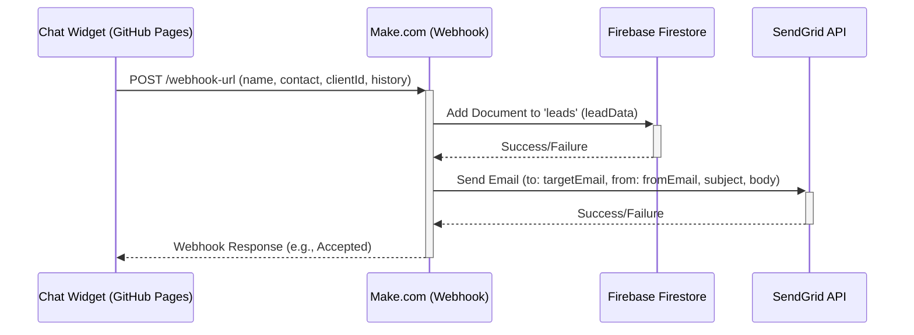

# שלב 3 - תוכנית אינטגרציה: קליטת לידים באמצעות Make.com Webhook

## הבעיה

לאחר מספר ניסיונות, נתקלנו בקשיים מתמשכים בפתרון בעיות CORS בעת שליחת נתוני לידים מהווידג'ט (שמתארח ב-GitHub Pages) לפונקציית השרת `/api/capture_lead` שמתארחת ב-Vercel. השרת ב-Vercel מחזיר שגיאת `405 Method Not Allowed` לבקשות `OPTIONS` מקדימות (preflight), מה שגורם לדפדפן לחסום את בקשת ה-`POST` עם נתוני הליד.

## הפתרון המוצע

נשתמש בפלטפורמת אוטומציה (כמו Make.com) וב-Webhook כדי לקלוט את נתוני הלידים ישירות מהווידג'ט. זה יעקוף את הצורך בתקשורת ישירה בין הווידג'ט לפונקציה ב-Vercel עבור זרימה זו, ובכך יפתור את בעיית ה-CORS. פלטפורמת האוטומציה תהיה אחראית על ביצוע הפעולות הנדרשות: שמירת הליד בפיירבייס ושליחת אימייל דרך SendGrid.

## שלבי הביצוע

1.  **הגדרת תרחיש (Scenario) ב-Make.com:**
    *   ליצור תרחיש חדש ב-Make.com.
    *   להוסיף מודול "Webhook" בתור הטריגר (Trigger).
    *   להגדיר את ה-Webhook ולקבל את כתובת ה-URL הייחודית שלו. יש לשמור כתובת זו.

2.  **עדכון קוד הווידג'ט (`public/widget.js`):**
    *   לאתר את הפונקציה `sendLeadToApi`.
    *   לשנות את כתובת ה-URL בבקשת ה-`fetch` מהקבוע `LEAD_CAPTURE_API_URL` (`/api/capture_lead`) לכתובת ה-Webhook שקיבלנו מ-Make.com בשלב 1.
    *   לוודא ששיטת הבקשה נשארת `POST` ושמבנה גוף הבקשה (ה-JSON עם `name`, `contact`, `clientId`, `history`) נשמר.

3.  **בניית הלוגיקה בתרחיש ב-Make.com:**
    *   **טריגר:** Webhook מקבל את הנתונים מהווידג'ט.
    *   **שלב 1 (Firebase):** להוסיף מודול "Firebase" -> "Firestore" -> "Add a Document".
        *   לקשר לחשבון הפיירבייס שלך.
        *   להגדיר את שם האוסף (Collection) ל-`leads`.
        *   למפות את הנתונים שהתקבלו מה-Webhook (name, contact, clientId, history) לשדות המתאימים במסמך. להוסיף חותמת זמן (למשל, באמצעות הפונקציה `now` של Make) ושדה סטטוס (למשל, `new`).
    *   **שלב 2 (SendGrid):** להוסיף מודול "SendGrid" -> "Send an Email".
        *   לקשר לחשבון ה-SendGrid שלך.
        *   להגדיר את כתובת הנמען ("To"). ניתן לקבוע אותה דינמית (למשל, על ידי קריאה נוספת מפיירבייס לפי ה-`clientId` כדי למצוא את `leadTargetEmail`) או להגדיר אותה ידנית ב-Make אם היא תמיד זהה.
        *   להגדיר את כתובת השולח ("From") באמצעות הכתובת המאומתת שלך.
        *   לבנות את נושא ותוכן האימייל תוך שימוש בנתוני הליד שהתקבלו מה-Webhook.

4.  **הוצאה משימוש של פונקציית Vercel (אופציונלי):**
    *   לאחר שהתהליך דרך Make.com ייבדק ויוכח כאמין, הפונקציה `/api/capture_lead` ב-Vercel לא תהיה נחוצה יותר עבור קליטת לידים. ניתן יהיה להסיר אותה או לשנות את ייעודה.

## תרשים זרימה (Mermaid)

## יתרונות הגישה

*   פתרון בעיות ה-CORS העיקשות.
*   תהליך קליטת לידים אמין יותר.
*   גמישות וקלות בהוספת אינטגרציות עתידיות (כמו CRM) דרך Make.com.
*   ניהול ויזואלי של תהליך עיבוד הליד.

## חסרונות הגישה

*   תלות בשירות צד שלישי (Make.com).
*   עלות פוטנציאלית אם עוברים את מגבלות התוכנית החינמית.
*   עיכוב קל (latency) נוסף בתהליך.
*   הלוגיקה של עיבוד הליד מנוהלת מחוץ לקוד הפרויקט.